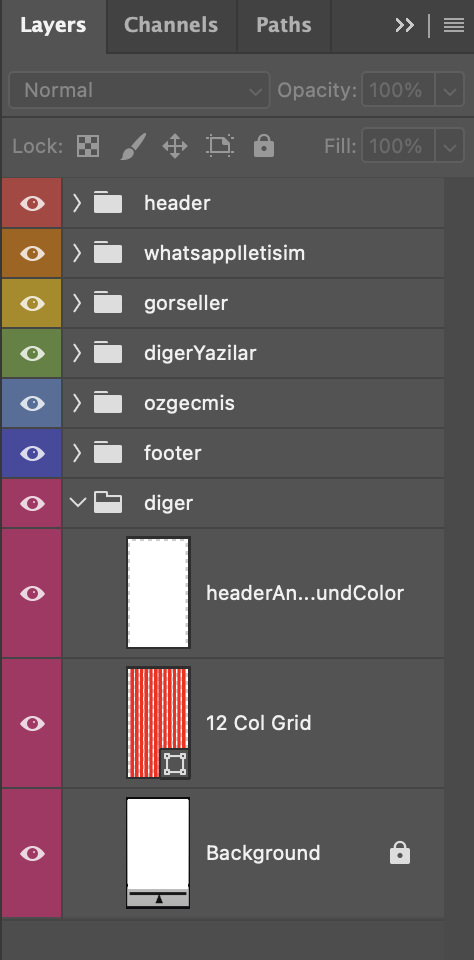
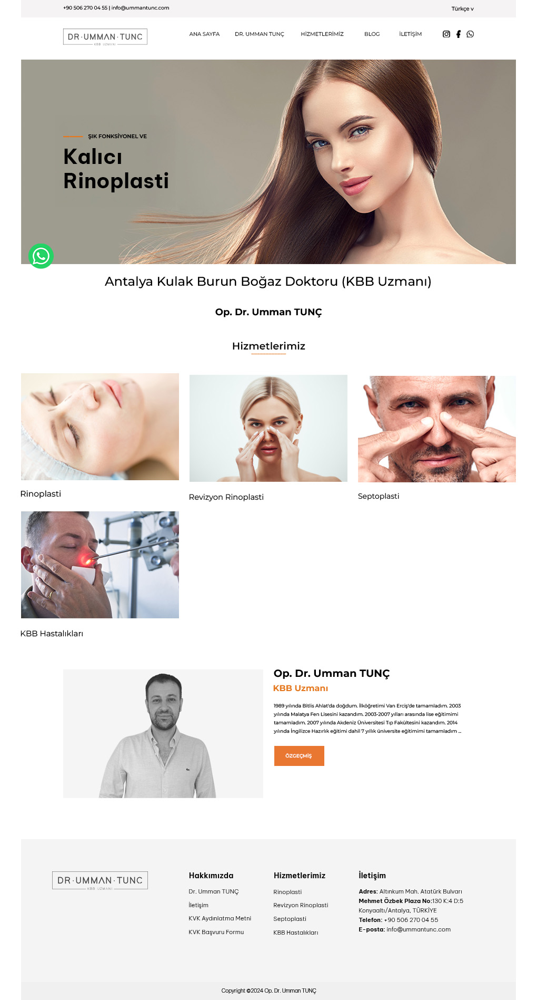

# Web Arayüz Tasarımı

Bu proje, **Adobe Photoshop** kullanılarak hazırlanmış gerçek bir web arayüz tasarımıdır.  
Görsel, ders kapsamında oluşturulmuştur.

---

# Katman Yapısı

Tasarımda düzenli bir çalışma yapısı sağlamak için klasörler ve renk etiketleriyle organize edilmiş katmanlar kullanılmıştır:

| Klasör / Katman | Açıklama |
|------------------|----------|
| **header** | Logo, menü ve dil seçimi alanlarını içerir |
| **whatsappIletisim** | Sabit WhatsApp iletişim butonu |
| **gorseller** | Banner ve hizmet görselleri |
| **digerYazilar** | Açıklama ve metin içerikleri |
| **ozgecmis** | Doktorun tanıtım alanı ve özgeçmiş butonu |
| **footer** | Alt menü ve iletişim bilgileri |
| **diger** | Grid sistemi, arka planlar ve yardımcı düzen katmanları |
| **12 Col Grid** | 12 kolonlu grid sistemi (Bootstrap uyumlu düzen mantığıyla hazırlanmıştır) |
| **Background** | Sayfanın temel arka plan rengi |

---

# Görseller

   
  <em>Katman yapısı — Photoshop görünümü</em>  
  
   
  <em>Tasarlanan web arayüzü — final görünüm</em>

---

# Kullanılan Araçlar
- **Adobe Photoshop CC**
- **12 Column Grid System (Responsive mantığı için)**  
- **Typography & Component düzeni**
- **Renk kontrastı ve kurumsal tasarım uyumu**

---

# ⚠️ Yasal Uyarı
Bu çalışma, **tasarım alıştırması** amacıyla hazırlanmıştır.  
Tasarımda kullanılan **isim, logo ve görseller**, gerçek web sitesinden esinlenilmiştir;  
Ticari amaç taşımamaktadır ve yalnızca **portfolyo gösterimi** içindir.  
Gerçek marka veya kişiyle doğrudan bağlantı kurulmamıştır.
